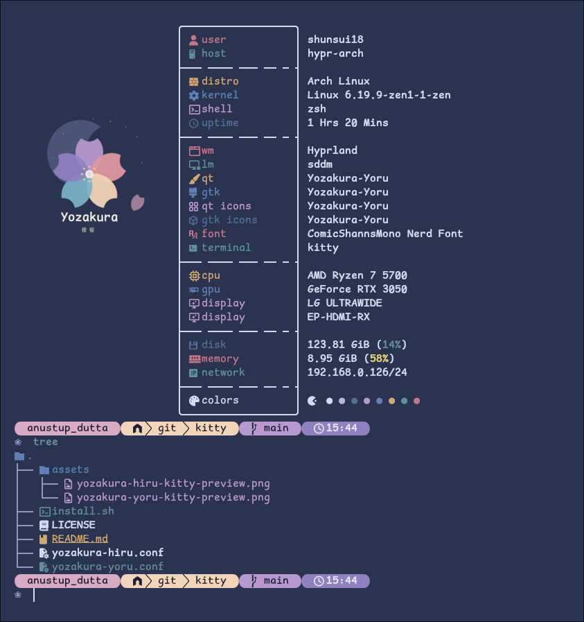

<div align="center">


# 夜桜 Yozakura — kitty Theme

A handcrafted pastel color palette for [kitty terminal](https://sw.kovidgoyal.net/kitty/), based on the [Yozakura](https://shunsui18.github.io/yozakura) palette.

[](LICENSE)
[](https://sw.kovidgoyal.net/kitty/)
[](install.sh)
[](https://github.com/shunsui18/yozakura)

</div>

---

## ✦ Flavors

| | Flavor | Description |
|---|---|---|
| 🌸 | **Yoru** *(night)* | Deep, moonlit background with soft sakura accents — default |
| ☀️ | **Hiru** *(day)* | Warm ivory canvas with gentle pastel tones |

<br>

<table>
<tr>
<td align="center"><b>🌸 Yoru</b></td>
<td align="center"><b>☀️ Hiru</b></td>
</tr>
<tr>
<td></td>
<td></td>
</tr>
</table>

---

## ✦ Installation

### One-liner

Install directly from this repository with a single command:

```bash
bash <(curl -fsSL https://raw.githubusercontent.com/shunsui18/kitty/main/install.sh)
```

> This runs with **Yoru** flavor by default.

---

### Options

| Flag | Values | Default | Description |
|---|---|---|---|
| `--theme` | `yoru` \| `hiru` | `yoru` | Which flavor to activate |
| `-h`, `--help` | — | — | Show help and list available flavors |

---

### Examples

```bash
# Yoru (night)
bash <(curl -fsSL https://raw.githubusercontent.com/shunsui18/kitty/main/install.sh) --theme yoru

# Hiru (day)
bash <(curl -fsSL https://raw.githubusercontent.com/shunsui18/kitty/main/install.sh) --theme hiru
```

---

### Manual Installation

If you prefer to install by hand:

```bash
# 1. Clone the repo
git clone https://github.com/shunsui18/kitty.git && cd kitty

# 2. Run the installer
bash install.sh --theme yoru
```

---

## ✦ What the Installer Does

1. **Self-locates** — resolves its own path regardless of where it is called from
2. **Validates** — confirms the requested theme file exists before touching anything
3. **Copies** all `yozakura-*.conf` files into `$HOME/.config/kitty/`, creating the directory if needed
4. **Patches** `$HOME/.config/kitty/kitty.conf`:
   - Replaces any existing `include *.conf` line with `include yozakura-<flavor>.conf`
   - Appends the include line if none is present in the config
   - Creates `kitty.conf` from scratch if it does not exist yet
   - Comments out any inline colour properties (e.g. `foreground`, `background`, `color0`–`color15`) already present in the config so the theme file takes full control — all other settings are left untouched
5. **Fails gracefully** — descriptive error messages if arguments are wrong or a theme file is not found

---

## ✦ File Structure

```
kitty/
├── assets/
│   ├── yozakura-yoru-kitty-preview.png
│   └── yozakura-hiru-kitty-preview.png
├── yozakura-yoru.conf
├── yozakura-hiru.conf
├── install.sh
├── LICENSE
└── README.md
```

---

<div align="center">

crafted with 🌸 by [shunsui18](https://github.com/shunsui18)

</div>